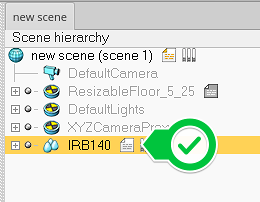

# Eclipse Lyo workshop handout

This handout is the companion guide for the hands-on session of the Eclipse Lyo workshop.

**Contents:**

<!-- TOC depthFrom:2 -->

- [Required software](#required-software)
- [Setting up the User Directory adaptor](#setting-up-the-user-directory-adaptor)
- [Setting up the Jira adaptor](#setting-up-the-jira-adaptor)
- [Bonus: build a digital twin for a V-REP simulator!](#bonus-build-a-digital-twin-for-a-v-rep-simulator)

<!-- /TOC -->

## Required software

- JDK 8
- Maven 3.5
- Eclipse Neon.3
- Eclipse Lyo Designer 2.3.0.M2
- Eclipse Lyo Core (OSLC4J) 2.3.0-SNAPSHOT
- Eclipse Lyo Store 2.3.0-SNAPSHOT
- Eclipse Lyo Store Update 2.3.0-SNAPSHOT
- Eclipse Lyo TRS Provider 2.4.0-SNAPSHOT
- Fuseki 3.5.0
- C++ compiler toolchain (`build-essential` on Ubuntu)
- MQTT broker (mosquitto is used in this tutorial)
- Jira
- V-REP
- Insomnia (no, not _that_ one; use this one to `GET` some `REST`)

## Setting up the User Directory adaptor

Before the adaptor can work properly, the triplestore dataset needs to be seeded. Use the following SPARQL query:

```sparql
INSERT DATA {
  <http://localhost:8082/adaptor-ad/services/serviceProviders/1/persons/jelx25> <http://xmlns.com/foaf/0.1/#familyName> "El-khoury" .

  <http://localhost:8082/adaptor-ad/services/serviceProviders/1/persons/jelx25> <http://xmlns.com/foaf/0.1/#givenName> "jad" .

  <http://localhost:8082/adaptor-ad/services/serviceProviders/1/persons/jelx25> <http://xmlns.com/foaf/0.1/#name> "jelx25" .

  <http://localhost:8082/adaptor-ad/services/serviceProviders/1/persons/jelx25> <http://www.w3.org/1999/02/22-rdf-syntax-ns#type> <http://xmlns.com/foaf/0.1/#Person> .

  <http://localhost:8082/adaptor-ad/services/serviceProviders/1/persons/admin> <http://xmlns.com/foaf/0.1/#familyName> "El-admin" .

  <http://localhost:8082/adaptor-ad/services/serviceProviders/1/persons/admin> <http://xmlns.com/foaf/0.1/#givenName> "admin" .

  <http://localhost:8082/adaptor-ad/services/serviceProviders/1/persons/admin> <http://xmlns.com/foaf/0.1/#name> "admin" .

  <http://localhost:8082/adaptor-ad/services/serviceProviders/1/persons/admin> <http://www.w3.org/1999/02/22-rdf-syntax-ns#type> <http://xmlns.com/foaf/0.1/#Person> .
}
```

> **NB!** This query needs to be run against the SPARQL Update endpoint, not the regular SPARQL Query one. E.g. `http://localhost:3030/JiraDataset/update`.

> Counting the number of users:
>
> ```sparql
> SELECT (COUNT(DISTINCT ?instance) AS ?count) WHERE {
>   ?instance a <http://xmlns.com/foaf/0.1/#Person> .
> }
> ```

Generation parameters for the Semantic properties tab:

- `javaClassBaseNamespace="org.eclipse.lyo.misc.jworkshop.users"`
- `javaFilesBasePath="../adaptor-users-webapp/src/main/java/" `
- `jspFilesBasePath="../adaptor-users-webapp/src/main/webapp/" `
- `javascriptFilesBasePath="../adaptor-users-webapp/src/main/webapp/"`


`contextInitializeServletListener` code block:

```java
try {
    Properties props = new Properties();
    InputStream jiraPropertiesStream = ActiveDirectoryAdaptorManager.class.getClassLoader().getResourceAsStream("jira.properties");
    props.load(jiraPropertiesStream);
    String sparqlQueryUrl = props.getProperty("sparqlQueryUrl");
    String sparqlUpdateUrl = props.getProperty("sparqlUpdateUrl");
    store = StoreFactory.sparql(sparqlQueryUrl, sparqlUpdateUrl);
} catch (IOException e) {
    log.error("problem loading properties file", e);
    System.exit(1);
}
```

`getServiceProviderInfos` code block:

```java
ServiceProviderInfo anSP = new ServiceProviderInfo();
anSP.name = "the only SP";
anSP.serviceProviderId = "1";
serviceProviderInfos = new ServiceProviderInfo[] {anSP};
```

`queryPersons` code block:

```java
// This is a very primitive query functionality. We ought to at least
// use the proper term oslc.searchTerms for such a search, instead of "where".
try {
    resources = new ArrayList<Person>();
    List<Person> allResources = store.getResources(new URI("urn:x-arq:DefaultGraph"), Person.class, 100, 0);
    for (Person person : allResources) {
        if ((where == null) || (person.getName().equals(where)))
            resources.add(person);
    }
} catch (Exception e) {
    log.error("Failed to get a User resource based on query", e);
    return new ArrayList<Person>();
}
```

`getPerson` code block:

```java
try {
    URI changeRequestUri = Person.constructURI(serviceProviderId, personId);
    aResource = ActiveDirectoryAdaptorManager.store.getResource(new URI ("urn:x-arq:DefaultGraph"), changeRequestUri, Person.class);
} catch (Exception e) {
    log.error("Failed to get a ChangeRequest resource", e);
}
```


## Setting up the Jira adaptor

Open the webhooks configuration page (http://localhost:2990/plugins/servlet/webhooks) and add the webhook for the following URL:

    http://localhost:8081/adaptor-jira/services/jira/webhooks/issues

Select the _created, updated, deleted_ events.

The user code for the initialisation should be the following.

`contextInitializeServletListener` code block:

```java
try {
    Properties props = new Properties();
    InputStream jiraPropertiesStream = JiraAdaptorManager.class.getClassLoader().getResourceAsStream("jira.properties");
    props.load(jiraPropertiesStream);
    String sparqlQueryUrl = props.getProperty("sparqlQueryUrl");
    String sparqlUpdateUrl = props.getProperty("sparqlUpdateUrl");
    store = StoreFactory.sparql(sparqlQueryUrl, sparqlUpdateUrl);

    changeProvider = new JiraChangeProvider();
    updateManager = new StoreUpdateManager<>(store, changeProvider);
    String topic = "TRSServer";
    client = new MqttClient("tcp://localhost:1883", "JiraAdaptor");
    client.connect();
    updateManager.addHandler(new TrsMqttChangeLogHandler<Object>(JiraTrsService.changeHistories, client, topic));
} catch (IOException e) {
    log.error("problem loading properties file", e);
    System.exit(1);
} catch (MqttException e) {
    e.printStackTrace();
}
```

`class_attributes` block:

```java
public static Store store = null;
private static final Logger log = LoggerFactory.getLogger(JiraAdaptorManager.class);

public static JiraChangeProvider changeProvider;
public static StoreUpdateManager<Object> updateManager;
private static MqttClient client;
```

`getChangeRequest` code block:

```java
try {
    URI changeRequestUri = ChangeRequest.constructURI(serviceProviderId, changeRequestId);
    aResource = JiraAdaptorManager.store.getResource(new URI ("urn:x-arq:DefaultGraph"), changeRequestUri, ChangeRequest.class);
} catch (Exception e) {
    log.error("Failed to get a ChangeRequest resource", e);
}
```

`queryChangeRequests` code block:

```java
try {
    resources = new ArrayList<ChangeRequest>(JiraAdaptorManager.store.getResources(new URI ("urn:x-arq:DefaultGraph"), ChangeRequest.class));
} catch (Exception e) {
    log.error("Failed to get ChangeRequest resources", e);
}
```

**Finally**, you need to copy two service classes: [JiraTrsService](src/JiraTrsService.java) and [JiraWebhooksService.java](src/JiraWebhooksService.java).

## Bonus: build a digital twin for a V-REP simulator!

In this step, you will get to extend our toolchain with an adaptor that will get from you from the development stage to working with operational data.

A Digital Twin adaptor will allow you to have a `Scene` resource with the `elementCount` property.

> You can also develop a far more complex vocabulary and use [V-REP Remote API](http://www.coppeliarobotics.com/helpFiles/en/remoteApiOverview.htm) to mirror resources in the twin from the V-REP scene if you have extra time and energy!

Start V-REP by typing `vrep.sh` in the terminal (from any folder).

Open the script by double clicking its icon on any element in the scene:



Under the clause `if (sim_call_type=sim_childscriptcall_initialization) then` of any script add the following line:

    simExtRemoteApiStart(19999)

Make sure the native library is compiled against `jni.h` (located under `/include`) and `jni_md.h` (located under `/include/linux` for the JDK on Linux) of the _same_ JDK where you will run the code describled below (**I have already done this for you, please see the line you need to use to run your Java program below**).

In the application VM startup parameters, be sure to add the right path to the folder where the newly built native extension is located:

    -Djava.library.path=/home/lyo/opt/V-REP_PRO_EDU_V3_4_0_Linux/programming/remoteApiBindings/java/lib

So... what now? Well, it's the right time to turn the V-REP example into a Lyo Store Update `ChangeProvider` in order to persist the resources in the triplestore and to publish the TRS updates over MQTT! Use the same skeleton and Lyo Store setup as in the Jira adaptor.
